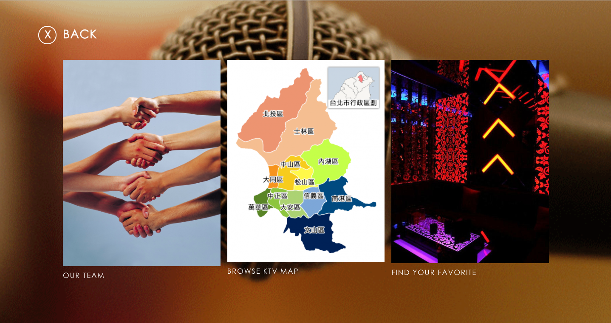
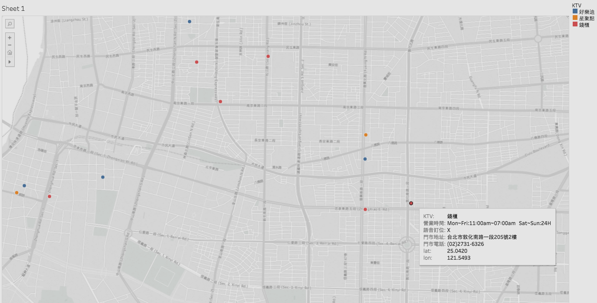
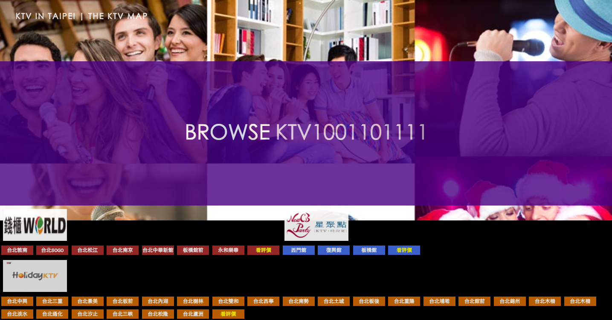
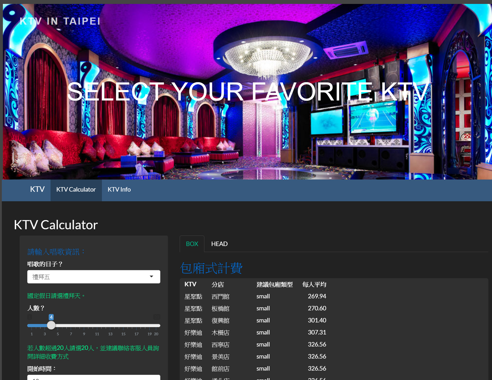
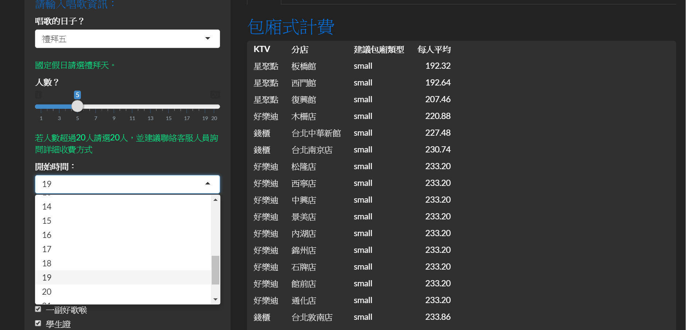
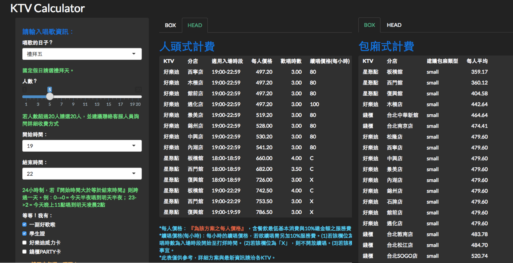
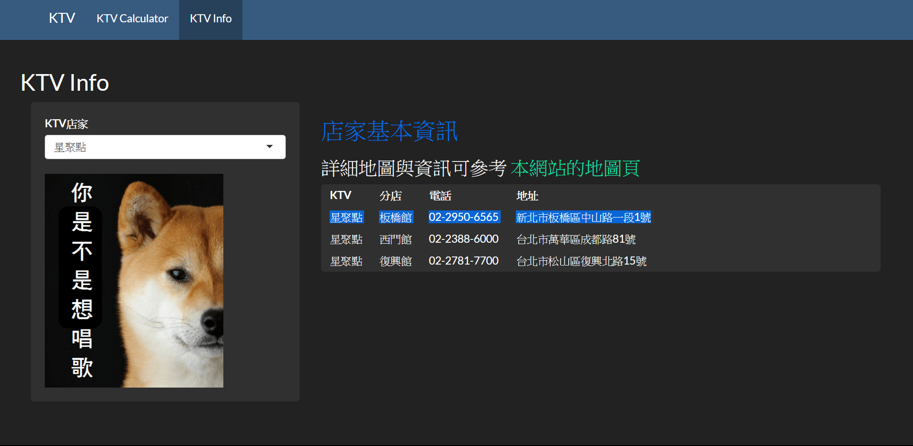
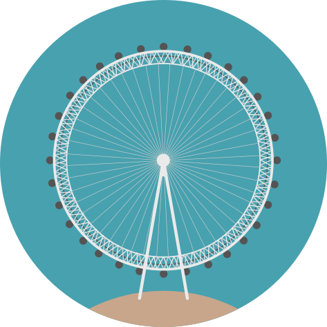
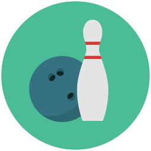

   
```{r setup, include=FALSE}
knitr::opts_chunk$set(echo = FALSE)
```

---


---


---


---


---


---


## ***Why***
<div class="white">**計價方式因不同因素而有差異**</div>

**KTV品牌**

**分店**
                                 

**日期時段**

**人數**
 

## ***How***  
<div class="white">**提供節省時間又能快速選擇的整合網站**</div>

<a href="http://ppt.cc/d1j7F" target="_self" title="連結替代文字">http://ppt.cc/d1j7F</a>


---



##Our Members

<div class="white">**由新聞媒體、商管、經濟的背景組成**</div>
<div class="white">**我們是一群喜愛唱歌的人**</div>


---



---



---



---



---



---




## ***Our Vision***
<div class="white">1.評論功能</div>


<div class="white">2.擴展至其他娛樂活動</div>





