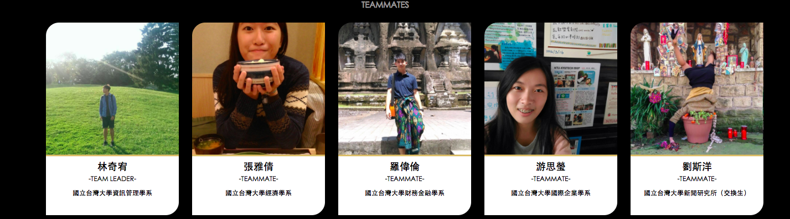
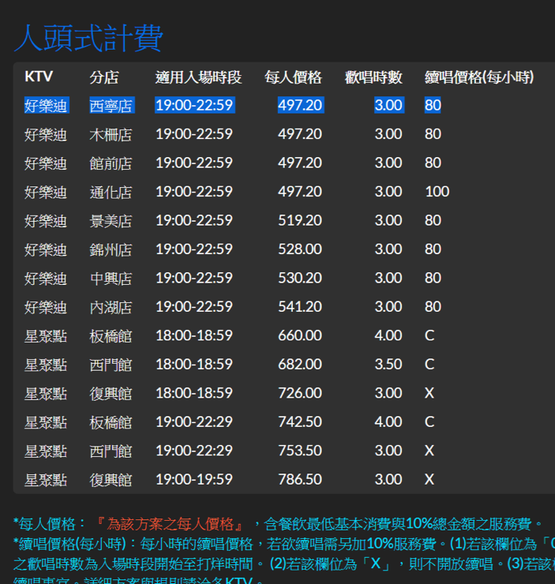

   
```{r setup, include=FALSE}
knitr::opts_chunk$set(echo = FALSE)
```

---


---


---


---


---


---


## ***Why***
<div class="red3">**計價方式因不同因素而有差異**</div>

**KTV品牌**

**分店**  
                                 

**日期時段**

**人數**
 

## ***How***  
<div class="blue3">**提供節省時間又能快速選擇的整合網站**</div>

<a href="http://ppt.cc/d1j7F" target="_self" title="連結替代文字">http://ppt.cc/d1j7F</a>


---


##Our Members



---


---


---


---


---



---


## ***Our Vision***
1.評論功能


2.擴展至其他娛樂活動


