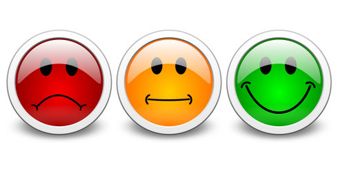
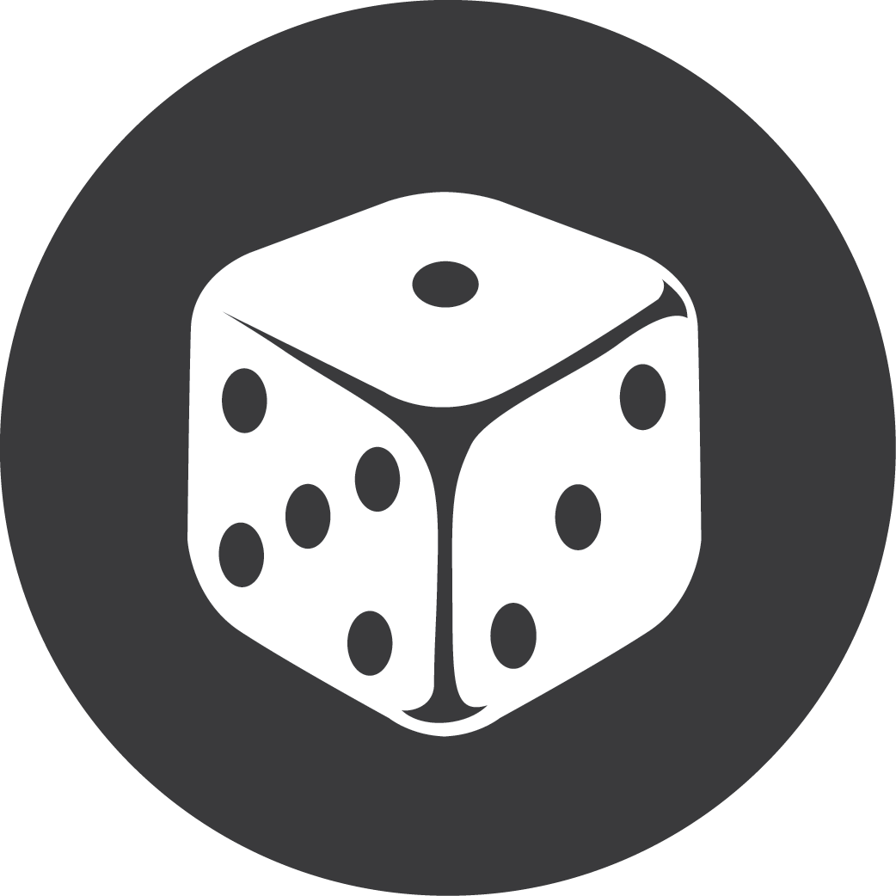

   
```{r setup, include=FALSE}
knitr::opts_chunk$set(echo = FALSE)
```

---

<div style="text-align: center"></div>

---

<div style="text-align: center"></div>

---

<div style="text-align: center"></div>

---

<div style="text-align: center"></div>

---

<div style="text-align: center"></div>

---

<div style="text-align: center"></div>


##
<h2 style = "color:white">Why</h2>
<div class="white">**計價方式因不同因素而有差異**
<div style="text-align: center">
**KTV品牌**

**分店**
                                 

**日期時段**

**人數**</div>
 

## 
<h2 style = "color:white">How</h2>
<div style="text-align: center"><div class="white">**提供節省時間又能快速選擇的整合網站**</div>

<a href="http://ppt.cc/d1j7F" target="_self" title="連結替代文字">http://ppt.cc/d1j7F</a></div>


---
<h2 style = "color:white">選單</h2>
<div style="text-align: center"></div>

##
<h2 style = "color:white">Our Members</h2>
<div style="text-align: center"><div class="white">**由新聞媒體、商管、經濟的背景組成**</div>
<div class="white">**我們是一群喜愛唱歌的人**</div>
</div>

##
<h2 style = "color:white">地圖搜尋</h2>
<div style="text-align: center"></div>


##
<h2 style = "color:white">找店家</h2>
<div style="text-align: center"></div>

##
<h2 style = "color:white">KTV計算機</h2>
<div style="text-align: center"></div>

##
<h2 style = "color:white">依需求做選擇</h2>
<div style="text-align: center"></div>

##
<h2 style = "color:white">包廂計價 v.s 人頭計價</h2>
<div style="text-align: center"></div>

##
<h2 style = "color:white">馬上找店家</h2>
<div style="text-align: center"></div>


## 
<h2 style = "color:white">Our vision</h2>
<div class="white">1.評論功能</div>



<div class="white">2.擴展至其他娛樂活動</div>



